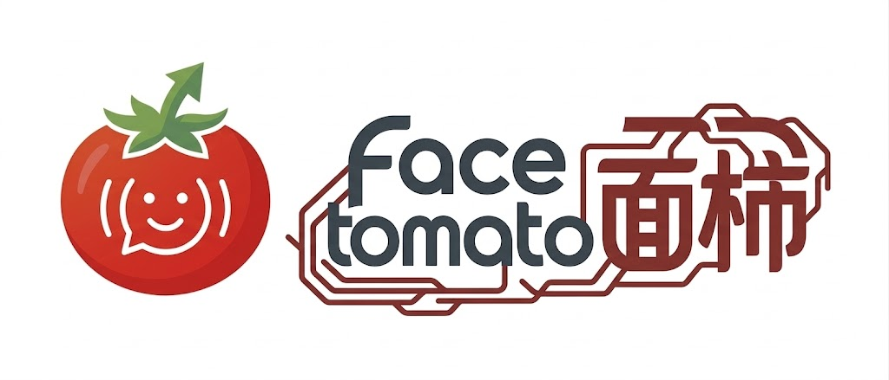

# FaceTomato · AI 辅助简历分析与模拟面试系统

<div align="center">



[](https://github.com/Infinityay/FaceTomato/stargazers)
[]()
[]()
[]()
[](https://github.com/Infinityay/FaceTomato/blob/main/LICENSE)

</div>

---
## ✨ 项目概述

**FaceTomato** 是一个面向技术类岗位求职场景的 AI 助手，当前聚焦前端开发、后端开发、大模型应用开发、大模型算法、搜广推算法、游戏开发、风控算法 7 个方向，覆盖从材料准备到面试演练的完整流程，主要能力包括：

- 简历解析
- JD 匹配分析
- 简历优化
- 面经题库检索
- 模拟面试
- 面试复盘
- 语音输入辅助答题

> FaceTomato 以 Tomato（番茄）为视觉与品牌意象，象征一种轻量但高价值、低门槛但强辅助的产品能力。
> 我们希望 FaceTomato 成为求职过程中的那个关键助攻：
> **🍅 代表着“平凡外表下的高效赋能，助你在关键时刻稳定发挥”**

## ⚡ 快速开始

项目支持两种启动方式：**源码启动** 和 **Docker 启动**。

### 1. 源码启动

#### 启动后端

```bash
cd backend
uv sync
cp .env.example .env
```

如果你要显式启用本地 RAG 检索或构建索引，再额外安装 `rag` 可选依赖（当前本地依赖组合面向非 Windows 平台；Windows 用户建议使用 Docker / Linux 环境，或继续使用 non-RAG fallback）：

```bash
cd backend
uv sync --extra rag
```

根据实际配置补全 `backend/.env` 后，运行后端服务：

```bash
uv run uvicorn app.main:app --reload --host 0.0.0.0 --port 6522
```

启动后可访问接口文档：`http://127.0.0.1:6522/docs`

#### 启动前端

```bash
cd frontend
npm install
npm run dev
```

前端默认地址：`http://127.0.0.1:5569`

### 2. Docker 启动

首次使用前，请先准备后端环境变量：

```bash
cp backend/.env.example backend/.env
```

然后在项目根目录执行：

```bash
docker compose up --build -d
```

如果你要构建 **RAG-capable** 的 backend 镜像，需要在构建阶段显式提供安装层开关：

```bash
BACKEND_INSTALL_RAG=true docker compose up --build -d
```

然后再在 `backend/.env` 中开启运行时开关：

```env
MOCK_INTERVIEW_RAG=true
```

前端默认地址：`http://127.0.0.1:5569`


## 🚀 核心能力

### 1. 📄 简历解析

支持 PDF、DOCX、PNG / JPG、TXT 等格式的简历上传，并自动提取结构化信息。

### 2. 🎯 JD 匹配分析

输入岗位描述后，系统会提取技能、学历、经验、职责等要求，并结合简历内容生成匹配评估。

### 3. ✍️ 简历优化建议

支持通用优化和 JD 定向优化两类模式，帮助用户提升表达、结构和关键词覆盖。

### 4. 📚 面经题库检索

支持 SQLite 分页检索、条件筛选、统计查看与邻近导航。

### 5. 🎙️ 模拟面试

支持 SSE 流式会话、对话框Markdown渲染、多轮追问、前端本地快照恢复与上下文延续。

### 6. 📝 面试复盘

支持对模拟面试过程生成结构化复盘报告，帮助用户定位表达、内容和回答策略上的改进点。


## 📦 环境要求

- Node.js >= 18
- npm >= 9
- Python >= 3.12, < 3.13
- uv

## 📚 面经数据准备（必读）

仓库默认**不会**提交面经题库数据，`backend/data/` 也被 `.gitignore` 忽略。

如果你希望在 FaceTomato 中查看真实面经题库，请先准备 `backend/data/interviews.db`。完整说明见：[`docs/interview-data.md`](./docs/interview-data.md)

文档中包含：

- `backend/data/` 目录说明
- `interviews.db` 获取方式
- 原始 JSON 数据目录要求
- 迁移脚本用法
- 本地 RAG 索引的可选构建步骤


## ⚙️ 配置说明

当前仓库中与配置和检索能力相关的说明主要包括：

- `backend/.env.example`
- `docs/README.md`
- `docs/backend/configuration.md`
- `docs/backend/rag-config.md`

## 🛠️ Runtime Settings

前端支持在运行时按请求覆盖后端默认配置，主要字段包括：

- LLM：`apiKey`、`baseURL`、`model`
- OCR：`ocrApiKey`
- Speech：`speechAppKey`、`speechAccessKey`

## 🗂️ 面经索引构建

建立面经索引前，请先按 [`docs/interview-data.md`](./docs/interview-data.md) 准备好 `backend/data/interviews.db`。

然后安装 `rag` 可选依赖（当前本地依赖组合面向非 Windows 平台）：

```bash
cd backend
uv sync --extra rag
uv run python scripts/build_interview_zvec_index.py
```


## 🤝 贡献指南

欢迎通过 Issue 和 Pull Request 参与项目建设。

详细贡献流程、TDD 要求、提交规范与 PR 说明请见 [CONTRIBUTING.md](./CONTRIBUTING.md)。

## ⚠️ 免责声明

本项目输出的分析结果、优化建议与模拟面试内容仅供参考，不构成任何招聘结果保证。

用户应对上传的简历、岗位描述及相关数据的合法性、真实性与合规性负责。

若项目接入第三方模型、语音服务或检索服务，相关服务的可用性、准确性与合规性由对应服务提供方负责。

除 `LICENSE` 中明确授予的权利外，第三方数据、素材、模型服务及其输出内容可能受各自条款约束。

开发者不对因使用本项目产生的直接或间接损失承担责任。

## 📄 许可证

本项目采用 **GNU Affero General Public License v3.0 (AGPL-3.0)** 许可证发布。你可以在 AGPL-3.0 许可范围内使用、修改和再分发本项目；当你分发本项目或其修改版本时，必须按照 AGPL-3.0 的要求提供对应源代码；如果你将修改后的版本作为网络服务提供给他人使用，还必须向远程交互用户提供对应源代码的获取方式。

具体条款以仓库根目录的 [LICENSE](./LICENSE) 文件为准。

## 致谢

- 感谢 [zvec](https://zvec.org/) 这个项目让我轻松的加入了 rag 功能;

- 感谢 LinuxDo 社区中佬友无私分享的的各种知识，这对我开发项目帮助很大。总之，学 AI, 上 [LinuxDo](https://linux.do/)!

## 📈 Star History

<a href="https://www.star-history.com/?repos=Infinityay%2FFaceTomato&type=date&legend=top-left">
 <picture>
   <source media="(prefers-color-scheme: dark)" srcset="https://api.star-history.com/image?repos=Infinityay/FaceTomato&type=date&theme=dark&legend=top-left" />
   <source media="(prefers-color-scheme: light)" srcset="https://api.star-history.com/image?repos=Infinityay/FaceTomato&type=date&legend=top-left" />
   
 </picture>
</a>
